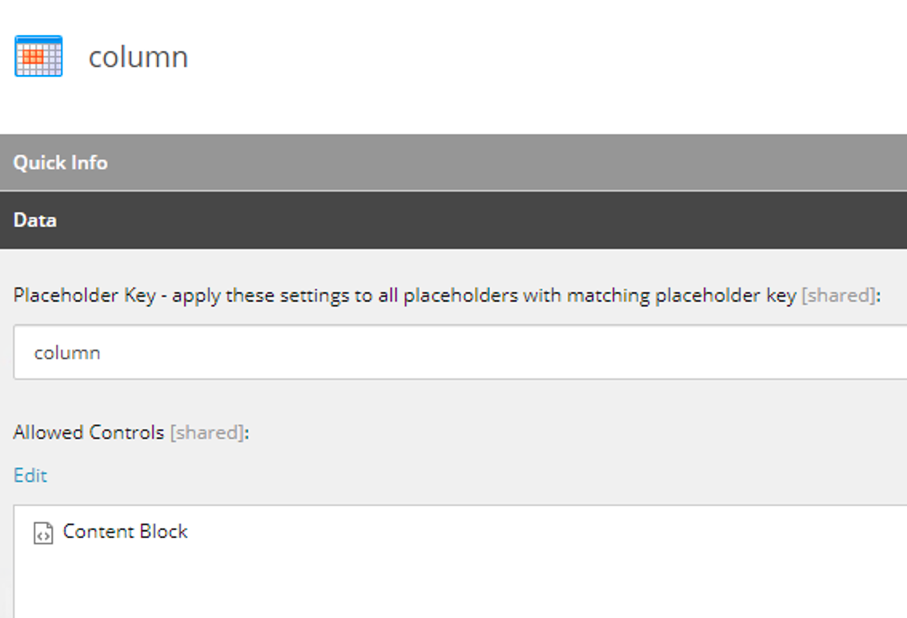
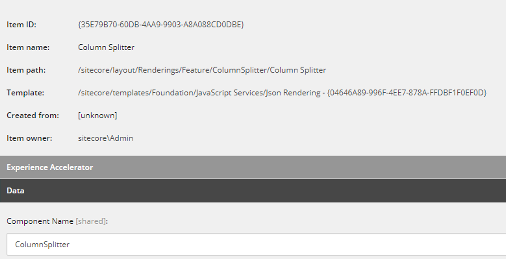
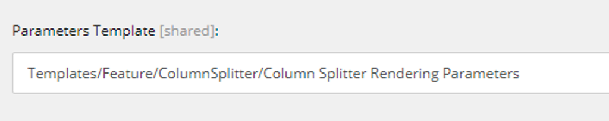
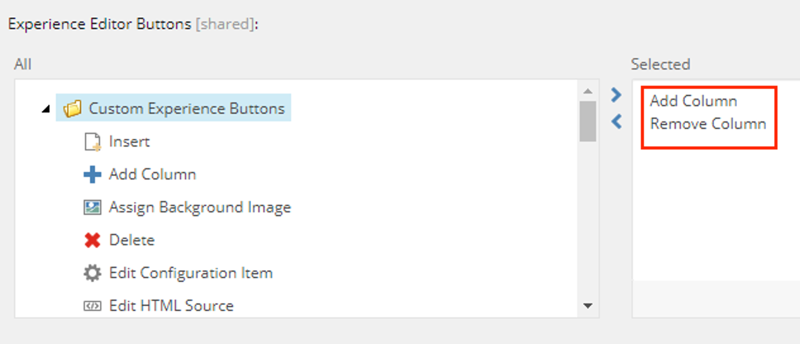
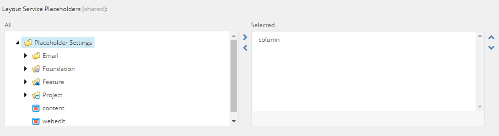
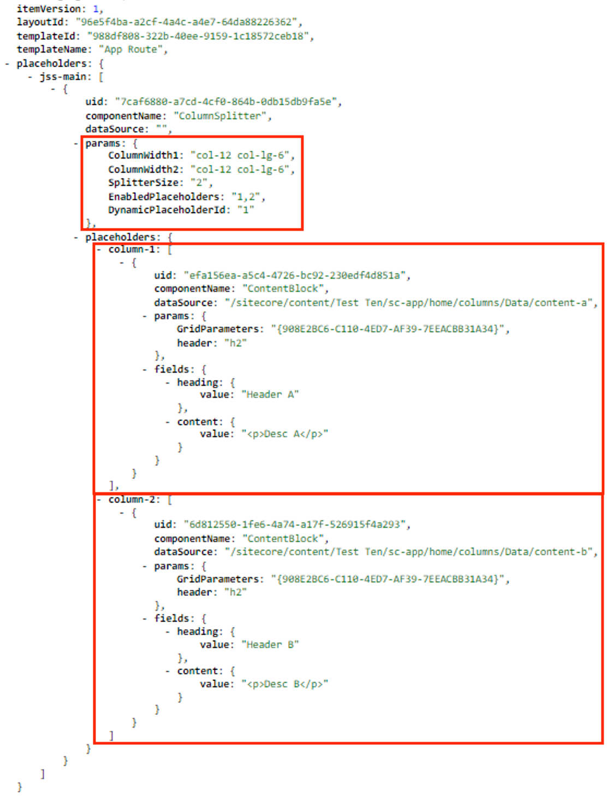

# SXA Column Splitter for Sitecore JSS


## Usage
* Add `Column Splitter` component to `Allowed Controls` of your main placeholder settings items.
* Add your renderings to `Allowed Controls` of `column` placeholder settings item.
* In Content or Experience Editor add `Column Splitter` component to your main placeholder, use +/- buttons to add/remove column in Experience Editor
* Set column size in component properties.
* Add your renderings to `column` placeholder.

## Setup Instructions
* **Prerequisite:** Follow [SXA Grid System with Sitecore JSS](https://smartsitecore.com/en/sxa-grid-system-with-sitecore-jss-part-1/) to configure grid system for your SXA Site. You only need to configure site settings items, changes to components, or pipelines described in this blog are not necessary.

* Deploy code and pipelines configuration from this repository. Sync items serialized with Unicorn. Check `Feature.ColumnSplitter.Serialization.config` for serialization project settings.
* If you don't want to synchronize items, follow the instruction to create new ones:
  * Create Rendering Parameters Template item inheriting from `/sitecore/templates/Feature/Experience Accelerator/Page Structure/Rendering Parameters/ColumnSplitter`.
    
    
    
  * Optionally add `_Standard Values` item for the template, with default column splitter values (e.g. two column split on desktop and one column on mobile). You can edit columns field using Raw values.
  * Create new `Placeholder Settings` item for placeholder `column`, assign your renderings to `Allowed Controls` field.
  
  * Create `Json Rendering` item poiting to your JSS implementation:
  
    * Select template created in first step in `Parameter Template` field.
    
    * Add `Add Column` and `Remove Column` in `Experience Editor Buttons` field.
    
    * Add `column` placeholder to `Layout Service Placeholders` field.
    
* Create and deploy equivalent JSS component. Implementation for React:

```javascript
import React from 'react';
import { Placeholder } from '@sitecore-jss/sitecore-jss-react';

const ColumnSplitter = ({ rendering, params }) => {
  const columns = params.EnabledPlaceholders?.split(',');
  return (
    <div className="row">
      {columns?.map((value) => {
        return (
          <div key={value} className={`col ${params[`ColumnWidth${value}`]}`}>
            <Placeholder name={`column-${value}`} rendering={rendering} />
          </div>
        );
      })}
    </div>
  );
};

export default ColumnSplitter;
```

* Verify your layout service if it contains rendering parameters for columns and columns splitted into separate placeholders:

